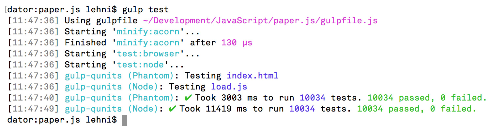

# gulp-qunits [](https://travis-ci.org/lehni/gulp-qunits)

Run hybrid unit tests through QUnit in a headless PhantomJS instance, as well as directly in Node.js.
Forked from [gulp-qunit](https://github.com/jonkemp/gulp-qunit) but developed as a separate project, for use in [paper.js](http://paperjs.org).



## Install

Install with [npm](https://npmjs.org/package/gulp-qunits)

```bash
$ npm install --save-dev gulp-qunits
```

[](https://nodei.co/npm/gulp-qunits/)

## Usage

#### PhantomJS QUnit Runner

```js
var gulp = require('gulp'),
    qunits = require('gulp-qunits');

gulp.task('test', function() {
    return gulp.src('test-runner.html', cwd: 'qunit' )
        .pipe(qunits());
});
```

With options:

```js
var gulp = require('gulp'),
    qunit = require('gulp-qunits');

gulp.task('test', function() {
    return gulp.src('test-runner.html', cwd: 'qunit' )
        .pipe(qunits({ arguments: ['--ssl-protocol=any']}));
});
```

#### Node.js QUnit Runner

```js
var gulp = require('gulp'),
    qunits = require('gulp-qunits');

gulp.task('test', function() {
    return gulp.src('test-runner.js', cwd: 'qunit' )
        .pipe(qunits());
});
```

With additional, optionally name-spaced requires:

```js
var gulp = require('gulp'),
    qunit = require('gulp-qunits');

gulp.task('test', function() {
    return gulp.src('test-runner.js', cwd: 'qunit' )
        .pipe(qunits({
            require: [
                { path: '../dist/paper-full.js', namespace: 'paper' }
            ],
            timeout: 20
        }));
});
```

## API

### qunits(options)

#### options.timeout

Type: `Number`  
Default: `5`

Pass a number or string value to override the default timeout of 5 seconds.

#### options.arguments

Type: `Array`  
Default: `undefined`

The arguments to be passed on to forked process, e.g. PhantomJS. See the
[PhantomJS documentation](http://phantomjs.org/api/command-line.html) for more
information.

#### options.checkGlobals

Type: `Boolean`  
Default: `false`

Causes QUnit to make a list of all properties in the global scope, before and
after each test, and then checks for differences. If properties are added or
removed, the test will fail, listing the difference. This helps to make sure
your test code and code under test doesn't accidentally leak into the global
scope. Currently this only works in the PhantomJS QUnit Runner.

## License

MIT © [Jürg Lehni](http://scratchdisk.com)
